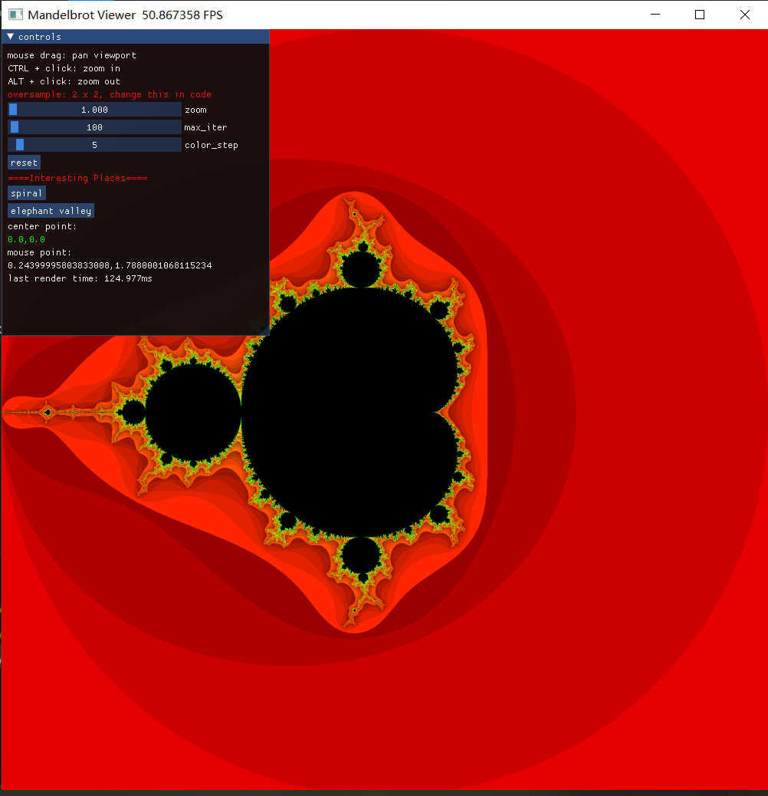
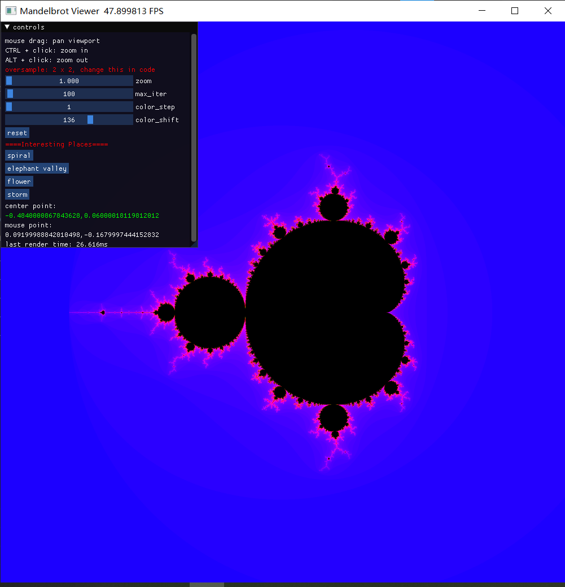
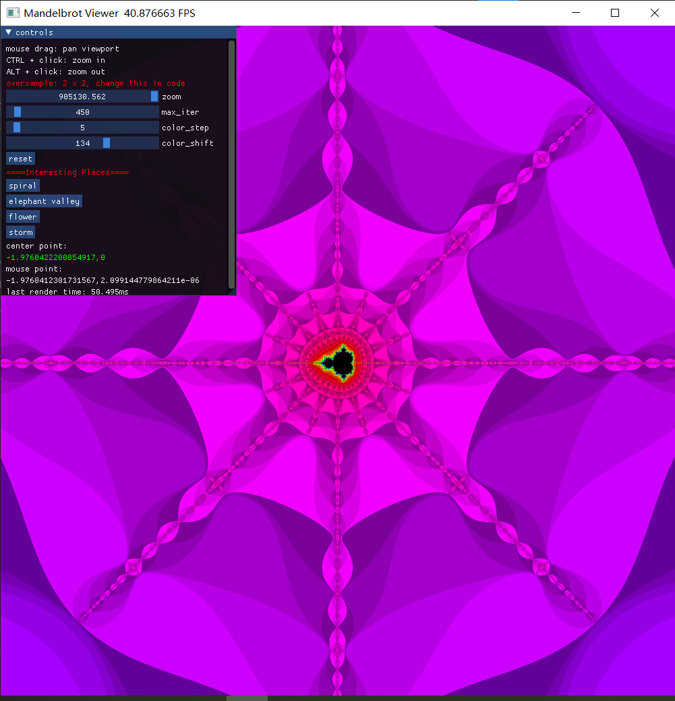

# Mandelbrot Set Viewer

## Controls

mouse drag: pan viewport

Ctrl + mouse click: zoom in

Alt + mouse click: zoom out

## Arch

default using `vulkan`, change this in main.py

```python
ti.init(arch=ti.opengl) # ti.gpu, ti.cuda, ti.dx11
```


| original               | customize color             |
| ---------------------- | ---------------------- |
|  |  |

| elephant valley             | flower               |
| ---------------------- | ---------------------- |
|  |  |

| spiral             | storm               |
| ---------------------- | ---------------------- |
|  |  |